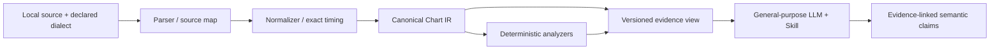

# MCI-0 Canonical Chart IR proposal

Version: proposed `mci-ir/0.1`. This is a design contract, not an implemented schema. Format evidence and compatibility findings are in the [research report](MCI0_RESEARCH_REPORT.md); experiment-specific projections are in the [benchmark protocol](MCI0_BENCHMARK_PROTOCOL.md).

The IR must preserve enough information to answer structural questions without reparsing source text. Keep exact timing, positions, slide topology, provenance and known gaps. Keep interpretations separate so an LLM can disagree with a technique hypothesis without changing a chart fact.

## 1. Layers and classifications



| Classification | Meaning | Examples |
| --- | --- | --- |
| RAW | Values or text preserved from an input artifact, including supplied metadata | Original modifier token, source bytes, catalog level string |
| NORMALIZED | Typed syntax, identifiers, configuration and canonical encodings under an explicit profile | `HOLD`, button 3, selected source slot, parser version |
| DERIVED | Reproducible computation from known inputs and declared rules | Resolved time, tempo segment, event group, density, candidate flag |
| SEMANTIC | Human/LLM interpretation or adjudicated domain meaning | Likely hand switch, reading pressure, term sense, section nickname |

Tables below classify **every declared field**. Comma-separated field names in one cell have the same classification. A collection/reference field is a NORMALIZED container unless stated otherwise; its children's classifications remain those in their own tables. No semantic fields are generated by the parser. Typed configuration is NORMALIZED provenance, not a chart observation.

## 2. Common conventions

- JSON UTF-8; explicit schema/profile versions. A complete canonical document has every field in the tables; nullable fields use `null`, collections use `[]`. Compact LLM projections may omit fields only according to a versioned projection manifest.
- `Rational` is a reduced string `n/d`, e.g. `"3/2"`, `"0/1"`, `"-1/4"`. Numerator is an integer, denominator a positive integer, gcd=1. This avoids binary floating-point and JSON integer-width ambiguity. Parse decimal source literals exactly before converting. Counts and small lane indices are JSON integers.
- Authoritative time is rational **chart seconds**, origin at the first notation position, before audio offset. Quarter-beat coordinate `q` starts at 0 and is distinct from musical meter. `audio_seconds = chart_seconds + audio_offset_seconds` where the offset is known. Negative audio times are allowed and must not be clamped.
- Display seconds are generated to six decimal places, round-half-even. Grouping, sorting, equality and interval calculations use exact rationals, never rounded display values or epsilon-based simultaneity.
- All analysis ranges are half-open `[start,end)`; point notes enter by onset. Sustained events enter an overlap query when `start < query.end && end > query.start`. A zero-duration event is a point and contributes no occupancy. Release instants can be requested explicitly.
- Arrays sort by exact resolved onset, then source ordinal, then expansion ordinal. No arbitrary hand/importance sorting. Retain source order for same-time display-order questions.
- Stable IDs derive from source SHA-256, selected body, source span, expansion ordinal and parser/profile version. Stability is promised for identical bytes and versions, not across arbitrary source edits. IDs for metrics additionally include analyzer version and parameters.
- Canonical serialization sorts object keys, uses the specified array order, and contains no timestamps or machine paths. Runtime logs/timestamps belong in the harness manifest. An optional semantic-content fingerprint excludes source formatting and provenance, and must never replace the source hash.
- Unknown is not zero, false, empty path or lane 8. A missing field caused by unsupported syntax creates a diagnostic and a completeness restriction. Invalid input is not an “empty chart.”

## 3. Shared record types

### SourceSpan and source attachments

| Field | Type | Class | Contract |
| --- | --- | --- | --- |
| `artifact_id` | string | NORMALIZED | Resolves to the original locally retained bytes |
| `byte_start`, `byte_end` | integer | DERIVED | Zero-based half-open offsets into those bytes; include original BOM/newlines in counting |
| `line`, `column` | integer | DERIVED | One-based decoded-text coordinates, derived from the same byte span |
| `raw_text` | string | RAW | Exact decoded fragment; excluded from primary C/D evidence views |

Encoding must be validated. Do not normalize Unicode/newlines before recording the source map. A canonical archive retains or references original bytes; `raw_text` alone is not byte-for-byte preservation.

### Location

| Field | Type | Class | Contract |
| --- | --- | --- | --- |
| `kind` | `BUTTON` / `TOUCH_SENSOR` | NORMALIZED | Button and screen sensor are different domains |
| `lane` | integer 1–8 or null | NORMALIZED | Button number, or numbered sensor index; center C uses null |
| `area` | `A` / `B` / `C` / `D` / `E` or null | NORMALIZED | Null for BUTTON; profile maps C/C1/C2 notation to the central Touch location while retaining raw spelling |

No physical coordinate is silently assigned. Geometry is a separate versioned analyzer input. A button can be hit through different physical contact methods; a button location is not a forced hand/contact strategy.

### DurationSpec

| Field | Type | Class | Contract |
| --- | --- | --- | --- |
| `source` | SourceSpan | NORMALIZED | Raw expression or source reference for an implicit profile default |
| `mode` | `SECONDS` / `FROZEN_BPM_QUARTERS` / `TEMPO_MAP_QUARTERS` | NORMALIZED | Preserves the duration's source semantics |
| `amount` | Rational | NORMALIZED | Seconds or quarter beats according to mode |
| `bpm_basis` | `EXPLICIT` / `NOTE_ONSET` / `TEMPO_MAP` / `NOT_APPLICABLE` | NORMALIZED | Makes tempo override attachment unambiguous |
| `explicit_bpm` | Rational or null | NORMALIZED | Only for an explicit source duration BPM |
| `is_implicit` | boolean | NORMALIZED | For default waits and short-Hold rules supplied by the declared dialect |
| `effective_bpm` | Rational or null | DERIVED | Resolved frozen BPM; null for map/seconds modes |
| `resolved_seconds` | Rational or null | DERIVED | Interval length, never an absolute time |
| `resolution_status` | `RESOLVED` / `UNKNOWN` / `INVALID` | DERIVED | Computed from syntax support and timing prerequisites |

Do not name one field `slideStartTime` while alternating between absolute movement-start and relative wait semantics.

### Diagnostic and Coverage

| Record.field | Type | Class | Contract |
| --- | --- | --- | --- |
| `Diagnostic.id`, `code`, `severity` | string | NORMALIZED | Stable code; severity INFO/WARNING/ERROR |
| `Diagnostic.source` | SourceSpan or null | NORMALIZED | Source causing the issue |
| `Diagnostic.message` | string | DERIVED | Template-generated factual explanation |
| `Diagnostic.affected_fields`, `affected_event_ids` | string[] | DERIVED | Field paths and affected entities |
| `Diagnostic.scope_seconds` | two Rational values or null | DERIVED | Unknown timing uses null, not guessed boundaries |
| `Diagnostic.effect` | `PRESERVED_ONLY` / `UNRESOLVED` / `REJECTED` | DERIVED | Documents how consumers must respond |
| `Coverage.status` | `COMPLETE` / `PARTIAL` / `INVALID` | DERIVED | Completeness relative to named capability, not universal format support |
| `Coverage.capability` | string | NORMALIZED | E.g. timing, note_types, slide_topology, path_geometry |
| `Coverage.scope_seconds` | range or null | DERIVED | Scope covered by the statement |
| `Coverage.diagnostic_ids` | string[] | DERIVED | Reasons for restrictions |

An unrecognized timing directive can invalidate the entire suffix. A missing geometric path length may leave onsets and total slide duration valid while invalidating per-segment trajectory metrics. Diagnose at that granularity.

## 4. Chart

One Chart represents one difficulty/revision, never the whole multi-difficulty container.

| Field | Type | Class | Contract |
| --- | --- | --- | --- |
| `schema_version`, `chart_id` | string | NORMALIZED | Version and deterministic local identity |
| `source_artifact_id`, `source_format`, `source_dialect`, `source_encoding` | string | NORMALIZED | Origin and explicit parser profile |
| `source_sha256` | string | DERIVED | Hash of original bytes |
| `selected_body` | string | NORMALIZED | E.g. `inote_5`; no implicit mapping to product difficulty |
| `metadata` | MetadataEntry[] | NORMALIZED | Ordered metadata, including duplicate/unknown keys |
| `identity` | ChartIdentity | NORMALIZED | Optional verified association with a catalog identity |
| `parser_name`, `parser_version`, `profile_version` | string | NORMALIZED | Reproduction inputs |
| `timeline` | Timeline | NORMALIZED | Exact timeline and syntax directives |
| `notes` | NoteEvent[] | NORMALIZED | Hit/hold objects, including at most one shared slide head |
| `slides` | SlideEvent[] | NORMALIZED | Track objects referencing heads rather than duplicating them |
| `sections` | Section[] | NORMALIZED | Explicit/derived ranges; parser normally emits no semantic section names |
| `derived_metrics` | DerivedMetrics | NORMALIZED | Empty metric collection until analyzers run |
| `diagnostics`, `coverage` | Diagnostic[], Coverage[] | NORMALIZED | Machine-readable limitations |
| `unmapped_source` | SourceSpan[] | RAW | Tokens/records retained without normalized meaning |
| `semantic_annotations` | SemanticClaim[] | SEMANTIC | Separate human/LLM output; empty in parser and primary benchmark input |

`MetadataEntry.key`, `value` are RAW strings; `source` is a NORMALIZED SourceSpan reference. Preserve author names/level strings as metadata, not interpretations. RAW entries are withheld in blinded benchmark views where they expose identity or answers.

`ChartIdentity` fields:

| Field | Type | Class | Contract |
| --- | --- | --- | --- |
| `provider`, `song_id`, `chart_type`, `difficulty`, `revision` | string or null | NORMALIZED | Explicit mapping of verified metadata to an identity namespace |
| `evidence_ref` | string or null | RAW | Supplied source/manifest record supporting that mapping |
| `mapping_status` | `VERIFIED` / `UNVERIFIED` / `UNKNOWN` | NORMALIZED | Assertion supplied by curator/adapter; not LLM guess |

Do not use title-only joins. STANDARD/DX, difficulty and chart revision can differ for the same song. Cross-format equality is an assertion to verify, not a consequence of matching names.

## 5. Timeline and TimingEvent

### Timeline

| Field | Type | Class | Contract |
| --- | --- | --- | --- |
| `origin` | `FIRST_NOTATION_POSITION` | NORMALIZED | Chart time zero |
| `audio_offset_seconds` | Rational or null | NORMALIZED | Effective parsed global/per-difficulty offset; null if unknown |
| `offset_source` | SourceSpan or null | NORMALIZED | Identifies winning container key; preserve superseded keys in metadata |
| `quarter_unit` | `QUARTER_NOTE` | NORMALIZED | Independent of meter/display bars |
| `events` | TimingEvent[] | NORMALIZED | Every supported directive, including changes during rests |
| `tempo_segments` | TempoSegment[] | DERIVED | Efficient exact mapping between chart seconds and quarter beats |
| `onset_groups` | EventGroup[] | DERIVED | Exact hit-onset groups |
| `slide_start_groups` | EventGroup[] | DERIVED | Equal movement-start groups, distinct from head onsets |
| `notation_end_seconds` | Rational or null | DERIVED | Explicit terminator or format-defined end; not last note onset |
| `last_event_end_seconds` | Rational or null | DERIVED | Latest release/track end, including tails after last onset |

### TimingEvent

| Field | Type | Class | Contract |
| --- | --- | --- | --- |
| `id`, `kind` | string, enum | NORMALIZED | Kind: BPM, GRID_DIVISION, GRID_SECONDS, METER, DISPLAY_SPEED, END |
| `source` | SourceSpan | NORMALIZED | Raw command available in source record |
| `source_ordinal` | integer | DERIVED | Directive order; same-position commands remain ordered |
| `position_quarters`, `time_seconds` | Rational or null | DERIVED | Resolved directive position |
| `value` | Rational or null | NORMALIZED | BPM, divider, seconds per comma or supported speed multiplier |
| `meter_numerator`, `meter_denominator` | integer or null | NORMALIZED | Only for an explicit source METER directive, never inferred from `{n}` |
| `source_bar`, `source_tick`, `source_resolution` | integer or null | RAW | Original MA2 coordinates when present |

`TempoSegment.start_quarters`, `end_quarters`, `start_seconds`, `end_seconds` are DERIVED Rational values; `bpm` is NORMALIZED Rational from the effective BPM directive; `timing_event_id` is NORMALIZED string reference. End may be null for an open final segment.

`EventGroup.id`, `basis` are NORMALIZED strings (`HIT_ONSET` or `SLIDE_MOVEMENT_START`); `time_seconds`, `member_ids`, `size` are DERIVED Rational/string[]/integer. A singleton is allowed. A fan's rendered stars do not automatically count as independent scored slides.

### Resolution rules

1. Numeric Simai subdivision `n` advances the source cursor by `4/n` quarters and `240/(B*n)` seconds. A change at a cursor applies in source order before subsequent advancement. Same-cursor repeated BPM directives remain in `events`; the final applicable one governs the next interval.
2. Absolute comma spacing advances seconds explicitly. For this first profile, initial BPM is required, allowing its quarter-beat increment to be derived from the active BPM. Generalized absolute-time charts with no BPM can later retain null quarter positions; do not invent a meter or BPM.
3. Ordinary Simai Hold/Slide lengths use frozen BPM, including source-specific overrides. A Slide wait resolves from the head/reference onset; track duration begins at movement start. Later BPM changes do not retroactively stretch a frozen duration.
4. MA2 maps `bar + tick/resolution` to format-bar position; ordinary quarter coordinates use four quarters per format bar for the validated profile. Retain METER independently. Nonstandard resolution/meter/version behavior stays unsupported until tested, rather than interpreting format bars as musical measures automatically.
5. For a tempo-map duration, integrate `60/B(q)` over its quarter interval, starting at the appropriate onset or movement-start coordinate. For frozen timing, `seconds = amount * 60 / effective_bpm`; for seconds mode, `seconds = amount`.
6. Pseudo-EACH and short-Hold defaults are dialect rules. Pin their provenance and test them. Never label a BPM-dependent simulator extension as universal Simai behavior.
7. A chart terminator is an END directive. Lexically distinguish `E` from `E1`–`E8` Touch tokens. If an event tail exceeds explicit chart end, preserve both times and issue a diagnostic; do not silently truncate a Hold/Slide.

Example distinction: a two-quarter Hold starting at 120 BPM, followed one quarter later by 240 BPM, lasts 1 second under frozen timing, but 0.75 seconds under tempo-map timing. Its raw beat amount alone cannot select between those meanings. This design follows the distinction explicitly implemented in [MuConvert Duration](https://github.com/MuNET-OSS/MuConvert/blob/73022f2e2bd931b6296c3182c4a1b4307d525e02/chart/mai/Duration.cs).

## 6. NoteEvent

| Field | Type | Class | Contract |
| --- | --- | --- | --- |
| `id`, `kind` | string, enum | NORMALIZED | TAP, HOLD, TOUCH, TOUCH_HOLD; Slide track has its own record |
| `source` | SourceSpan | NORMALIZED | Modifier attachment stays traceable |
| `source_ordinal`, `expansion_ordinal` | integer | DERIVED | Stable tie order and token expansion |
| `location` | Location | NORMALIZED | No conflation of button and Touch area |
| `onset_quarters`, `onset_seconds` | Rational or null | DERIVED | Exact hit/press timing |
| `duration` | DurationSpec or null | NORMALIZED | Required for Hold types; null for instantaneous Tap/Touch |
| `end_seconds` | Rational or null | DERIVED | Onset for instantaneous objects; release for Hold types |
| `is_break`, `is_ex`, `firework` | boolean or null | NORMALIZED | Parsed valid flags; null only when affected syntax is unresolved |
| `head_visual` | `NORMAL` / `STAR` / `ROTATING_STAR` / null | NORMALIZED | Visual form does not alter structural kind |
| `role` | `ORDINARY` / `SLIDE_HEAD` | NORMALIZED | Shared head is still one hit object |
| `slide_ids` | string[] | NORMALIZED | All linked tracks; empty if unrelated |
| `onset_group_id` | string or null | DERIVED | Exact hit group; not a hand assignment |

A Break Hold remains HOLD plus a flag. A Touch Hold remains structurally TOUCH_HOLD even if a separate scoring policy groups it under Hold. A headless Slide has no fabricated Tap event. A single head starting two tracks is counted once among hit onsets and links to both track IDs. Unsupported EX combinations are errors or preserved unknowns according to the profile, never generalized to all object types.

## 7. SlideEvent and SlideSegment

| SlideEvent field | Type | Class | Contract |
| --- | --- | --- | --- |
| `id`, `source` | string, SourceSpan | NORMALIZED | One independently timed track or connected chain |
| `head_note_id` | string or null | NORMALIZED | Shared reference; null for explicitly headless tracks |
| `headless_visual` | `NONE` / `FADE_IN` / `SUDDEN` / `UNKNOWN` | NORMALIZED | Retains distinction lost by a single no-head boolean |
| `reference_onset_quarters`, `reference_onset_seconds` | Rational or null | DERIVED | Timing anchor exists even with no hit head |
| `start_location` | Location | NORMALIZED | Start of path |
| `wait` | DurationSpec | NORMALIZED | Relative wait |
| `movement_start_seconds`, `end_seconds` | Rational or null | DERIVED | Track activity interval |
| `duration` | DurationSpec | NORMALIZED | Whole track traversal duration; for explicit segment durations, aggregated spec only when modes permit it, otherwise a resolved seconds spec with derived provenance |
| `duration_origin` | `WHOLE_PATH_SOURCE` / `SEGMENT_SUM` | NORMALIZED | Separates typed source duration from computed aggregation |
| `segments` | SlideSegment[] | NORMALIZED | Ordered symbolic topology; no flattening into start and end only |
| `is_break` | boolean or null | NORMALIZED | Track flag independent from its head |
| `shared_head_group_id` | string or null | DERIVED | Group only when head sharing is established |
| `slide_start_group_id` | string or null | DERIVED | Movement-start equality |
| `path_resolution` | `SYMBOLIC` / `GEOMETRY_VERIFIED` / `PARTIAL` | DERIVED | Does not imply original-game judgement equivalence |

For a `SEGMENT_SUM`, `duration.amount` and `duration.resolved_seconds` are **DERIVED**, overriding the general DurationSpec amount classification; its `mode=SECONDS` is NORMALIZED. Preserve original specs on segments so this convenience total does not erase source meaning.

| SlideSegment field | Type | Class | Contract |
| --- | --- | --- | --- |
| `id`, `source` | string, SourceSpan | NORMALIZED | Segment identity and exact spelling |
| `index` | integer | NORMALIZED | Zero-based chain order |
| `shape_token` | string | RAW | Source symbol or MA2 opcode |
| `shape_family` | enum | NORMALIZED | STRAIGHT, ARC, CENTER_V, TURN_V, P, Q, GRAND_P, GRAND_Q, S, Z, FAN, UNKNOWN |
| `direction` | `CW` / `CCW` / `NOT_APPLICABLE` / `UNKNOWN` | DERIVED | Only after profile-validated start/shape/end mapping; no simplistic global mapping of `<`/`>` |
| `start_location`, `end_selector` | Location | NORMALIZED | Explicit normalized syntax endpoints; fan selector is not its entire contact footprint |
| `waypoints` | Location[] | NORMALIZED | Explicit source waypoints, e.g. the V turning point |
| `duration` | DurationSpec or null | NORMALIZED | Null when only a whole-chain duration is stated |
| `start_seconds`, `end_seconds` | Rational or null | DERIVED | Null if internal timing cannot be resolved safely |
| `resolved_end_locations` | Location[] or null | DERIVED | Fan branch endpoints require a validated expansion rule; single path gives one |
| `geometry_profile_id` | string or null | NORMALIZED | Version of optional geometry data |
| `geometry_status` | `UNAVAILABLE` / `VERIFIED_FOR_PROFILE` | DERIVED | No guessed lengths or sensor paths |

For a shared-duration chain, retain the total time and all ordered segments even if their internal times are null. Allocate time by segment arc length only after geometry validation for the declared dialect. Equal-time allocation by segment count is not an acceptable substitute. Explicitly timed chains preserve each duration and any boundary behavior. An ordinary multi-track shared-head construct produces multiple SlideEvents; a connected chain produces one SlideEvent with multiple segments. See the independent [MuConvert Slide representation](https://github.com/MuNET-OSS/MuConvert/blob/73022f2e2bd931b6296c3182c4a1b4307d525e02/chart/mai/Slide.cs).

## 8. Section

| Field | Type | Class | Contract |
| --- | --- | --- | --- |
| `id` | string | NORMALIZED | Stable range identity |
| `origin` | `SOURCE_MARKER` / `FIXED_WINDOW` / `STRUCTURAL_CANDIDATE` / `HUMAN_RANGE` | NORMALIZED | Explains who selected the range |
| `source` | SourceSpan or null | NORMALIZED | Explicit marker if present |
| `source_label` | string or null | RAW | Preserve a source label without endorsing its meaning |
| `start_seconds`, `end_seconds` | Rational | DERIVED | Resolved boundaries; human-selected raw boundaries belong in the annotation input |
| `start_quarters`, `end_quarters` | Rational or null | DERIVED | Resolved position in quarter coordinates |
| `event_ids`, `metric_ids` | string[] | DERIVED | Contents/support selected by documented interval rules |
| `selection_rule`, `selection_version` | string or null | NORMALIZED | Fixed-window or change-detector provenance |
| `semantic_label`, `semantic_reason` | string or null | SEMANTIC | Human/LLM only; null in canonical parser output and omitted from primary benchmark views |

A fixed 8-quarter window is a structural Section. Calling it “chorus” or “stamina climax” is a separate semantic annotation. Human Gold Set sections must not be injected into whole-chart localization inputs as preselected difficulty candidates.

## 9. DerivedMetrics and analyzer definitions

### Contract

| Field | Type | Class | Contract |
| --- | --- | --- | --- |
| `DerivedMetrics.analyzer_version`, `counting_policy`, `geometry_profile_id` | string or null | NORMALIZED | Explicit computation policy; geometry can be absent |
| `DerivedMetrics.records` | Metric[] | NORMALIZED | Empty until computed |
| `Metric.id`, `name`, `unit`, `algorithm_version` | string | NORMALIZED | A named, versioned formula |
| `Metric.parameters` | Parameter[] | NORMALIZED | Each parameter `name`, typed `value` and `unit` is NORMALIZED |
| `Metric.scope_seconds` | two Rational values | DERIVED | Exact analyzed range |
| `Metric.value` | integer / Rational / boolean / null | DERIVED | One scalar per record; series use multiple records |
| `Metric.support_event_ids`, `support_metric_ids` | string[] | DERIVED | Auditable inputs |
| `Metric.status` | `COMPLETE` / `LOWER_BOUND` / `UNAVAILABLE` | DERIVED | Partial count must not masquerade as exact |
| `Metric.limitation_codes` | string[] | DERIVED | Missing geometry, unresolved timing, strategy dependence, etc. |

Canonical metrics never contain freeform “difficulty reasons.” An analyzer can deterministically emit a candidate under a rule, but the rule's applicability remains an interpretation concern.

### Counting policies

Maintain separate structural counts: Tap/Touch hits, Hold/Touch Hold starts, shared heads, independent Slide tracks, connected segments and fan branches. Modifier counts overlap structural categories. Never add Break count to a structural total that already includes Break-flagged notes.

Primary `hit_onset_v1` density counts each NoteEvent once at its onset, including a shared head once; it excludes Slide movement starts and releases. Report `slide_start_v1` density separately. Scoring totals are a later versioned mapping with independently checked rules, not `len(notes)+len(slide_segments)`. Reconcile with FluentMai catalog counts only after checking revision and provider counting conventions.

### Formulas and ownership

| Metric / owner | Concrete definition | Limitation supplied to Skill |
| --- | --- | --- |
| Hit density / analyzer | `count(onsets in [a,b)) / (b-a)` in hits/s; return unavailable for zero-length range | Contains no physical-effort weight |
| Sliding-window density / analyzer | Windows 1, 2, 4 seconds at 0.25-second steps; 4/8-quarter windows at one-quarter steps; full windows only for peaks, clipped edge windows separately flagged | Windows anchored to chart origin, not annotation peaks; count and window length accompany every rate |
| Simultaneous-note rate / analyzer | Event-based: hits belonging to groups of size >=2 divided by all hits; group-based: groups of size >=2 divided by all onset groups | Declare denominator; report Slide movement groups separately |
| Timing spacing / analyzer | Gaps between consecutive distinct hit-group onsets, rational beat gaps where available; also per-lane hit gaps | Zero gaps belong to simultaneity; mixed source timing can make beat labels inappropriate |
| Lane movement distance / analyzer | Circular button distance `min(abs(i-j),8-abs(i-j))`, 0–4 steps, for explicitly named pairs | Touch omitted without geometry; no arbitrary within-chord order |
| Adjacent-group movement proxy / analyzer | Between consecutive button-onset groups report minimum and maximum pair distance; no pairing is asserted | Bounds describe positions, not hands or complete required travel |
| Chord span / analyzer | Maximum pair distance within an onset group | A span is measurable; “large” needs a declared threshold |
| Slide overlap / analyzer | Duration of pairwise intersection of `[movement_start,end)`; waiting intervals reported separately | Time overlap alone does not imply spatial conflict or impossibility |
| Hold overlap / analyzer | Same interval logic over press/release intervals and hit times | Does not model release leniency or body/contact choices |
| Repetition / analyzer | Exact motifs of 3–8 onset groups using group location/type/flag sets and rational relative gaps; optional rotation-normalized matches in a separately named metric | Relative-gap normalization and transposition can erase relevant differences; original motif always retained |
| Hand-travel proxy / optional analyzer | A small two-agent assignment search over hit groups with explicit initial positions, button geometry, Hold occupancy and objective; report minimum path cost under those constraints | A lower-bound surrogate, not observed hands; unavailable with missing contacts/geometry or groups outside solver scope |
| Interaction candidates / analyzer | Enumerate active Slide/Hold plus competing hits in a declared temporal horizon; attach IDs and overlap/gap evidence | Without geometry call it a temporal candidate; a spatial interference claim needs verified path/contact rules |
| Section candidates / analyzer | Fixed windows, long gaps, density/tempo transitions under frozen parameters | No semantic names or guarantee of hardest-section recall |
| Difficulty, reading/execution burden, stamina / Skill or human | Interpret several metrics with player/technique context and alternatives | No universal difficulty number follows from these proxies |

Use deterministic parameter settings chosen on development charts, freeze before test. Arithmetic belongs in the evidence generator; the LLM should not manually count thousands of notes or invent distances. Boundary windows must include crossing Hold/Slide context; otherwise interaction metrics are invalid.

## 10. SemanticClaim: explicit downstream output

| Field | Type | Class | Contract |
| --- | --- | --- | --- |
| `id`, `producer`, `producer_version` | string | NORMALIZED | Human or model/Skill provenance |
| `scope_seconds` | rational range or null | NORMALIZED | Declared claim scope in the canonical coordinate system |
| `concept_id`, `text`, `alternatives` | string / string[] | SEMANTIC | Meaning and alternative readings |
| `confidence`, `abstention_reason` | enum / string or null | SEMANTIC | Claimed confidence is not a calibrated probability |
| `evidence_event_ids`, `evidence_metric_ids`, `definition_refs` | string[] | SEMANTIC | Producer-selected support; existence checked deterministically afterward |
| `evidence_validation` | `VALID_REFERENCES` / `INVALID_REFERENCES` / `UNCHECKED` | DERIVED | Valid IDs do not by themselves prove entailment |

Unknown slang is not normalized into an invented `concept_id`. Leave it unresolved, preserve the original wording in a semantic record, and describe observable structure neutrally. Author identity is metadata; style is a comparative hypothesis requiring examples and human review.

## 11. Illustrative JSON evidence projection

This is a valid JSON **projection**, not a complete canonical archive. IDs are readable aliases for illustration; the prototype derives stable IDs as above. Source spans, provenance, nullable defaults and raw metadata are intentionally omitted here. No subjective labels are present.

Original synthetic body: `(120){4}1/5,1-4[4:1],3h[4:1],E`, offset zero. Its four hit onsets include the Slide head; its one track moves from 1.0 to 1.5 seconds. The Hold at 1.0 lasts 0.5 seconds. The terminal `E` creates no NoteEvent.

```json
{
  "schema_version": "mci-ir/0.1",
  "chart_id": "synthetic-example",
  "timeline": {
    "audio_offset_seconds": "0/1",
    "notation_end_seconds": "3/2",
    "last_event_end_seconds": "3/2",
    "events": [
      {"id": "t1", "kind": "BPM", "time_seconds": "0/1", "value": "120/1"},
      {"id": "t2", "kind": "GRID_DIVISION", "time_seconds": "0/1", "value": "4/1"},
      {"id": "t3", "kind": "END", "time_seconds": "3/2", "value": null}
    ]
  },
  "notes": [
    {"id": "n1", "kind": "TAP", "location": {"kind": "BUTTON", "lane": 1, "area": null}, "onset_seconds": "0/1", "end_seconds": "0/1", "role": "ORDINARY", "slide_ids": []},
    {"id": "n2", "kind": "TAP", "location": {"kind": "BUTTON", "lane": 5, "area": null}, "onset_seconds": "0/1", "end_seconds": "0/1", "role": "ORDINARY", "slide_ids": []},
    {"id": "n3", "kind": "TAP", "location": {"kind": "BUTTON", "lane": 1, "area": null}, "onset_seconds": "1/2", "end_seconds": "1/2", "role": "SLIDE_HEAD", "slide_ids": ["s1"]},
    {"id": "n4", "kind": "HOLD", "location": {"kind": "BUTTON", "lane": 3, "area": null}, "onset_seconds": "1/1", "end_seconds": "3/2", "role": "ORDINARY", "slide_ids": []}
  ],
  "slides": [
    {
      "id": "s1",
      "head_note_id": "n3",
      "reference_onset_seconds": "1/2",
      "wait": {"mode": "FROZEN_BPM_QUARTERS", "amount": "1/1", "effective_bpm": "120/1", "resolved_seconds": "1/2"},
      "movement_start_seconds": "1/1",
      "end_seconds": "3/2",
      "segments": [
        {"id": "s1.0", "index": 0, "shape_family": "STRAIGHT", "start_location": {"kind": "BUTTON", "lane": 1, "area": null}, "end_selector": {"kind": "BUTTON", "lane": 4, "area": null}}
      ]
    }
  ],
  "derived_metrics": {
    "counting_policy": "hit_onset_v1",
    "records": [
      {"id": "m1", "name": "hit_density", "scope_seconds": ["0/1", "3/2"], "value": "8/3", "unit": "hits/s", "support_event_ids": ["n1", "n2", "n3", "n4"], "status": "COMPLETE"}
    ]
  },
  "semantic_annotations": []
}
```

This example supports “a Hold begins while the Slide is moving.” It does not prove which hand hits the Hold or that the interaction is difficult.

## 12. Loss accounting, validation and future ML use

Loss awareness is stronger than keeping a raw string beside an incomplete object. Every construct must have a normalized representation, a preserved-only diagnostic, or a rejection. A future `ParseResult` envelope contains `status` (DERIVED COMPLETE/PARTIAL/INVALID), `chart` (NORMALIZED Chart or null), and `diagnostics` (NORMALIZED Diagnostic[]). No successful parse status is returned when timing is unknowable.

Required validation before benchmark use:

- Exact source coverage for nontrivia tokens; valid lane/sensor and path endpoints; no invented notes from terminators.
- Head, branch and chain cardinality checks; independent head/track modifiers; duration and wait nonnegativity under the admitted profile.
- Monotonic resolved cursor, ordered tempo changes and consistent exact time conversions; rational normalization.
- References exist; same source token does not create duplicate shared heads; no heuristic merging of simultaneous notes.
- Cross-boundary Hold/Slide inclusion; END versus tail diagnostics; no implicit audio offset assumption for video comparisons.
- Unknown syntax preservation and affected-suffix invalidation; determinism across two identical runs; malformed input cannot hang.
- Independent synthetic expected results and parser differential checks. Round-trip agreement with the same parser is insufficient because two steps can share a bug.

A future feature extractor consumes this IR through a versioned projection: never mutate it into tensors or overwrite exact times. Keep timestamps, type/flags, Touch coordinates, slide paths, masks, source ranges and truncation manifests. Rotation/reflection augmentations must transform paths and geometry consistently and do not automatically preserve difficulty. Split datasets by song/revision before fitting any preprocessing. No feature training is proposed in MCI-0.
